# JAWS - Just Another Weather Station

This is just another weather station (*JAWS*) which is derived from the [Solar Powered WiFi Weather Station](https://www.instructables.com/id/Solar-Powered-WiFi-Weather-Station-V20/) project from [instructables](http://instructables.com). You build some electronics, 3D-print a case, load this software, configure an app on your phone, and you're all set. What could be simpler? This software relies on the [Blynk](https://blynk.io) service to collect data in the cloud and make it available to the app on your phone. In the future, other services may be supported.

The weather station is configured using a Web User Interface where the user will specify information such as:

* The location of the weather station
* How often it should take readings
* API keys for the underlying services (like Blynk)
* etc.

Some of this configuration information is specific to *JAWS* while other information is common to any web-connected device. You can learn more about such `WebThing`'s [here](https://github.com/jpasqua/WebThing).

*JAWS* also has an optional GUI that can be used for [simple weather modules](#simple-module) (typically indoors) where you would like to be able to see the readings directly.

## Dependencies

<a name="libs">
### Libraries
The following third party libraries are used within this project:

* [Adafruit_BME280](https://github.com/adafruit/Adafruit_BME280_Library)
* [Adafruit_Sensor](https://github.com/adafruit/Adafruit_Sensor) 
* [Arduino-Log](https://github.com/thijse/Arduino-Log)
* [ArduinoJson (v6)](https://github.com/bblanchon/ArduinoJson)
* [BlynkSimpleEsp8266](https://github.com/blynkkk/blynk-library)
* [ESPTemplateProcessor](https://github.com/jpasqua/ESPTemplateProcessor)
* [TimeLib](https://github.com/PaulStoffregen/Time.git)
* [WebThing](https://github.com/jpasqua/WebThing)
* **Optional**
  * Only required for GUI
      * [esp8266-oled-ssd1306](https://github.com/ThingPulse/esp8266-oled-ssd1306)
      * [IoAbstraction](https://github.com/davetcc/IoAbstraction)
  * Only required for DS18B20 sensor (additional temperature sensor)
      * [Arduino Temperature Control](https://github.com/milesburton/Arduino-Temperature-Control-Library) 
      * [OneWire](https://github.com/PaulStoffregen/OneWire)

### Services
The following services play a role in providing parts of the functionality:

 - [Blynk](https://blynk.io): Provides a repository of weather data and the ability to view using a mobile app. Without this you will only be able to see current values via the we interface.
 - Services used by WebThing
	 - [Google Maps](https://developers.google.com/maps/documentation): Used for geocoding and reverse geocoding. Though not absolutely necessary, it does make using the system a bot more convenient.
	 - [TimeZoneDB](https://timezonedb.com): Used to get local time and time zone data. This is used to timestamp data.

<a name="organization"></a>
## Organization

### Directory Structure
The directory structure of the project is shown below. You don't need to know this to build and use the project, but if you want to work on it, this will give you an idea of where everything is located.

````
    JAWS
        [Primary Source files including JAWS.ino]
        /data
            [HTML page templates for JAWS]
            /wt
                [HTML page templates for WebThing]
        /doc
            /images
        /src
            /clients
                [Sensor Interfaces]
            /gui
                [Implementation of all of the Screens]
````

### Code Structure

The primary functional areas of *JAWS* are given below. You don't need to know this to build and use the project, but if you want to work on it, this will give you an idea of where the different functionality is implemented.

* `JAWS`
	* The primary logic for the application. It holds various objects, like the settings, that are available throughout the project. `JAWS` uses the `WebThing` framework and follows the organization it defines for the setup and loop functions.
	* `JAWS` calls the `GUI` as part of its main loop to give it time to execute.
* `JAWSSettings`
	* Provides the functionality to read, write, and update settings that are shared throughout the application.
* `JAWSWebUI`
	* Implements the Web UI for *JAWS* which primarily consists of pages that allow the user to view and update the settings of the device. When settings change in the Web UI, it calls back into the core of the code to have those changes reflected. 
	* **NOTE**: Currently the real-time handling of changes is not very thorough. Many changes require a reboot to take effect.
* `GUI` + `Screen`
	* `GUI` is the primary interface used to cause `Screens` to be displayed and updated, and for user input (button presses) to be processed.
	* The heavy lifting for this is done by specialized implementations of the `Screen` class. There is a `TimeScreen`, a `GraphScreen`, an `InfoScreen` and so on. Each screen is responsible for displaying and updating the associated information.
	* **Note**: There is a file named `NoGUI.cpp` which contains stub implementations of the functions in the GUI namespace. If there is no attached display, it is used (automatically) in place of `GUI.cpp`.
* `clients`
	* The clients provide access to data from sensors. In the future the clients could provide information from other sources as well.
* `HWConfig.h` is used to provide configuration information related to the *JAWS* hardware. For example, if you have an attached display and input button, they are described here. Similarly, any additional (optional) sensors are configured here. **Note**: `HWConfig.h` is not checked into github - you must create it based on the provided template (`HWConfigTemplate.h`) which is checked in.

<a name="building-jaws"></a>
## Building JAWS

*JAWS* has been built and tested with Arduino IDE 1.8.10 and ESP8266 cores 2.6.1 and 2.7.1. Newer versions are likely to work, but I haven't tried other specific combinations. If you have never built an Arduino project using an ESP8266, you'll need to [prepare your development environment](https://github.com/esp8266/Arduino#installing-with-boards-manager). 

### Hardware

#### Configuring Your Hardware

There are many ways to assemble a working weather station and a couple of primary examples are given below. Regardless of which you choose, you need to provide some configuration information by editing the file `HWConfig.h`. In it you will specify things such as which pins to use for the I2C bus, whether there is a display attached for a local GUI, and whether there is a secondary sensor attached. There are a number of pre-configured blocks of settings you can choose from, or you can specify all the details for yourself.

Notes:

* The BME sensor and the display (if you have one) are both I2C devices and therefore share pins. You can configure which pair of pins to use or use one of the sample configurations.
* The BME sensor and the display each have a unique address. The typical addresses for these devices is already set in `HWConfig.h`, but you can change them. When you physically connect the hardware, make sure that the BME sensor and the display are both connected to the same pins.


<a name="full-hw"></a>
#### Full Weather Station

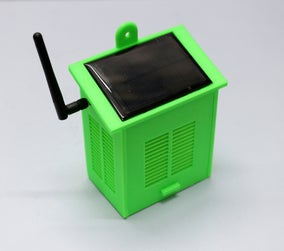

You can build a full solar-powered weather station using the list of required hardware and assembly instructions from the [instructables site](https://www.instructables.com/id/Solar-Powered-WiFi-Weather-Station-V20/). There is even a [PCB](https://www.pcbway.com/project/gifts_detail/Solar_Powered_WiFi_Weather_Station_V2_0.html) available which makes for a very neat result.

In a few minutes you'll be reading about [low power mode](#ulpm) and it will mention using a switch/jumper to bypass it. You'll need to add that switch or jumper to the PCB. I used the same type of slide switch used for the power switch. Place it on the board on the pads labeled `GND`, `D7`, and `VCC`. Sliding the switch so it connects D7 to GND bypasses low-power mode.

<a name="simple_module"></a>
#### Simple Weather Module
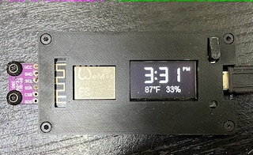

If you want to have a simple weather sensor that does not have solar charging, you can use a standard ESP8266 with a BME280 sensor. For example, you may want a module in the garage, a shed, the attic, etc. For these applications (typically indoors or otherwise protected), you may also have a display to show the readings locally. You can even use an integrated module like [this one](https://usa.banggood.com/Nodemcu-Wifi-And-NodeMCU-ESP8266-0_96-Inch-OLED-Module-Development-Board-p-1154759.html?cur_warehouse=CN) that has the display pre-integrated.

### Adding a Display

By adding a local display and a push button, *JAWS* can provide a very simple GUI which reads out the primary values from the weather sensor. The display must be:

* 128x64 pixels wide
* Based on either an SH1106 or an SSD1306 driver
* Driven by I2C
* Compatible with the [esp8266-oled-ssd1306](https://github.com/ThingPulse/esp8266-oled-ssd1306) library (most are)

Interacting with the device requires a single momentary push button. You must tell *JAWS* about the hardware you chose and how you chose to connect it. This is done in the  `HWConfig.h` file.

**Notes**:

* **Important**: There is a setting which tells *JAWS* whether a local display is attached. It is `false` by default which means that even if you connect a display, it won't show anything until you change the setting. The easiest way to do this is to modify the default value of `hasGUI` from `false` to `true` in `JAWSSettings.h`.
* `HWConfig.h` is not checked into github - you must create it based on the provided template. Only the template (`HWConfigTemplate.h`) is checked in.

#### Additional Sensors

*JAWS* normally takes all of its readings (temperature, humidity, and barometric pressure) from a single BME280 sensor. These sensors have taken some heat (no pun intended) for yielding inaccurate / inconsistent temperature readings. You may wish to use a sensor designed for temperature such as the [DS18B20](https://www.adafruit.com/product/374). If you add one of these sensors, you'll need to enable it in `HWConfig.h` file. You'll see a line that designates which pin the DS18B20 sensor is connected to. If the pin is set to `-1`, then *JAWS* assumes no additional sensor is attached. If it is not `-1` then *JAWS* will access the DS18B20 using that pin. It will use the temperature value from the DS18B20 in place of the reading from the BME280.

### 3D Model
The original housing for this project as well as some others are available on thingiverse. Here is a sampling:

 - [Original](https://www.thingiverse.com/thing:3395393)
 - [Alternative 1](https://www.thingiverse.com/thing:3615016)
 - [Alternative 2](https://www.thingiverse.com/thing:3551386)

<a name="software"></a>
### Software
Building the software for *JAWS* is a bit more complex than a typical application because it stores files on the ESP8266 file system. This means that you need to use a plug-in to the Arduino IDE to upload those files to the Arduino. The file structure is described in detail in the [*WebThing*](https://github.com/jpasqua/WebThing) readme file. In this section I will describe the steps involved.

1. Download and install the [`ESP8266 Sketch Data Upload`](https://github.com/esp8266/arduino-esp8266fs-plugin) plug-in. Note that installing this plugin is not the same as installing a normal Arduino library. Follow the installation instructions [here](https://github.com/esp8266/arduino-esp8266fs-plugin#installation). If you have installed successfully, you will see a new menu item in the Arduino IDE Tools menu. See the screen shot below.
2. Copy or link the `wt` directory from [*WebThing*](https://github.com/jpasqua/WebThing) `data` directory to the *JAWS* `data` directory. When you're done you'll have a `data` directory that contains a number of `HTML` files and a `wt` subdirectory. The `wt` subdirectory will also contain `HTML` files.
3. You need to reserve some flash memory space for the file system. In the Tools menu of the Arduino IDE you will see a `Flash Size` submenu. Choose `FS: 1MB`.
4. Now connect your ESP8266 to your computer via USB and select the `ESP8266 Sketch Data Upload` item from the tools menu. You will see all the files in your `data` directory, including those in the `wt` subdirectory being loaded onto your ESP8266.
5. Finally you can proceed as usual and compile / upload *JAWS* to your ESP8266.

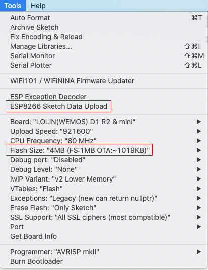

<a name="preparation"></a>
## Setting up JAWS

<a name="ulpm"></a>
### Understanding and Configuring Low Power Mode

First things first: JAWS is designed for low power operation. The way it achieves this is by powering on, taking readings, sending the data to Blynk, and powering back off again. It will wake up again some time in the future (say 10 minutes) and repeat the cycle. Low power mode is great for long life with on a battery that recharges with solar energy. It's not the right model if you want to have a responsive, always-on device. We'll look at these cases separately.

#### Making the Most of Low Power Mode

When you power-up JAWS for the first time, low power mode will be disabled. That means you can interact with the Web interface freely to get it configured just the way you want it before [turning on low power mode](#low-power-mode). Once you've enabled low power mode and rebooted, *JAWS* will enter the `power-on, take-readings, power-off`, cycle mentioned above.

But what if you want to change a setting? You won't be able to get to the Web interface because JAWS will power itself before you have a chance to do anything! That's where the override mode comes in. If you're using the [full hardware](#full-hw) implementation described above, you'll have a switch/jumper you can use to override low power mode in hardware. Flip that switch and reboot.

At that point *JAWS* will not enter low power mode even though it has been configured to do so. Now you are free to connect to the web interface and change any settings you'd like (including the setting for low power mode). When you've made your changes and saved them, you can flip the switch/jumper back and reboot. *JAWS* will now go back to honoring the power mode setting.

#### Always-on Operation

If you have an attached display for a GUI, or want to be able to access the Web interface any time, or want to use HomeBridge integration, you'll need to avoid low power mode. Of course this will drain your battery much faster, so you will probably want to use a power supply of some sort instead.

Since low power mode is off by default in *JAWS*, you don't need to do anything special. If you have turned on low power mode for some reason, use the instructions in the previous section to turn it back off.

### Getting Started with Configuration

Before you get started, you will need API keys for the services mentioned above (Google Maps, TimezoneDB, and Blynk). All are free. Please go to each site, create a key, and keep track of them. You'll need to supply them during the configuration process. 

<a name="connecting-to-your-network"></a>
### Connecting to your network
Once you have assembled your hardware and loaded the firmware, the weather station will boot and create its own WiFi access point. Connect to the new access point you will see on your phone or computer's wifi connection list. It will have an SSID of the form `jawsNNNNNN`. Once you do, you will enter a "captive portal" where you can configure the weather station for your actual WiFi base station. When you've done that, you can reset the weather station and it will connect to your wifi network.

At this point it will make a web interface available. You can connect using either an IP address or a hostname:

- **IP Access**: You need to determine the IP Address used by the weather station. You have a couple of choices here:
    - If you are still connected via USB, you will see the IP address in the Arduino Serial Monitor
    - You can use a scanning tool or your router to look for the device on your network
- **Hostname**: If your system supports mDNS (e.g. a Mac or a Raspberry Pi running avahi) you can connect to hostname.local in your browser. Hostname will either by a name that you set in Settings.h or a name of the form `jawsNNNNNN`.


### Configuring JAWS

Once connected, you can use the web interface to configure and change settings regarding your printers, how information is displayed, the weather configuration, and more. You get to the settings by selecting an item from the [hamburger menu](https://en.wikipedia.org/wiki/Hamburger_button) in the top left of the web page. Before getting to settings that are specific to *JAWS*, you need to configure some general information for your web-connected device including a username / password. You do this using the *General Settings* menu item as described below.

Note: If you have mounted your display in an enclosure in a way that is upside-down relative to the default configuration, you're image will be upside down until you get around to the [Configure JAWS)[] menu. This isn't a problem since the configuration will be happening in the Web UI, not on the display, but if it bothers you, you can skip to that step to flip the display orientation and then come back here.

<a name="general-settings"></a>
  

These settings are common to many network connected devices and are encapsulated by the [*WebThing*](https://github.com/jpasqua/WebThing) library. The settings you must configure are listed below in the order you will want to enter them on a new device. In general, once you have entered the General Settings once, you won't need to change them again. When you are setting up your device for the first time, you will need to enter some of the settings, save, and reboot before you can enter the rest. In particular, you'll need to enter the API keys before you can geolocate your address.

* **API Keys**: You need these keys to be entered in order to use the location options below and to have the time set.
	* [Google Maps](https://developers.google.com/maps/documentation/javascript/get-api-key): Fill in the api key you acquired from for the Google Maps service
	* [TimeZoneDB](https://timezonedb.com/api): Fill in the api key you acquired from for the TimezoneDB service. Note: NTP is perhaps a more natural choice for a time service, but it does not incorporate a mechanism for time zone determination. TimeZoneDB allows WebThing to get the time, time zone, and local time without need for another mechanism. **Note** that these keys will not be active until after you have saved them and rebooted the device.
* **Username / Password**: The username / password you'll use when you connect to *JAWS*. This is not the same as any username/password you use to log into your printers. It defaults to admin/password. ***You should change these*** the first time you configure *JAWS*.
* Web Server Settings:
	* **Hostname**: A network name for your *JAWS* device. If you configure a name such as `JAWS`, then you can access your device from a browser using the address `http://JAWS.local` rather than using the IP address. This only works on systems that have support for mDNS. This is native on Macs but can be added to Linux and Windows with software such as [Avahi](https://github.com/lathiat/avahi).
	* **Port**: The port that *JAWS* will listen on. Usually 80 unless you've got a good reason.
* Location Settings: For * JAWS* the location settings are used to determine the proper time zone. The city for which weather is shown may be anywhere and is not required to be the same location as you enter here.
	* **Latitude, Longitude, Elevation**: In *JAWS*, these are only used to determine your time zone (for this purpose elevation is not important).
	* **Address** / Geocode: Since you probably don't know your lat/lon and elevation, enter an address in the Address field and press the Geocode button. Assuming you have already saved your Google Maps API key, the address will be translated to lat/lon and elevation. If you prefer not to create a Google Maps key, you can find your lat/lon manually as [described here](https://support.google.com/maps/answer/18539?co=GENIE.Platform%3DDesktop&hl=en).
* **Theme Color**: Choose a theme for the Web UI that suits your style. The themes are all from the [W3.CSS](https://www.w3schools.com/w3css/w3css_color_themes.asp) set.
* **Indicator LED**: Ignore this section. The Indicator LED functionality is not used by *JAWS*.

<a name="configure-jaws"></a>
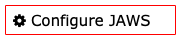 

Now that the General Settings are out of the way, you can adjust settings that are specfic to *JAWS*:

- **Description**: A description that is useful to the user. For example, the location of the weather station like "Back Yard" or "Garden".
- **Use Metric**: Determine whether to use metric or imperial units when sending values to Blynk or displaying values in the interface
- **Blynk API Key**: An API key established by the user when configuring the Blynk app.
- **Temperature Correction**: A value (positive or negative) to add to the temperature sensor reading to calibrate it to a reading you've taken with a known correct device. Note that this is always in degrees celsius even if the values are to be displayed in imperial units.
- **Humidity Correction**: A value (positive or negative) to add to the humidity sensor reading to calibrate it to a reading you've taken with a known correct device. 

<a name="low-power-mode"></a>
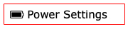

As discussed [above](#ulpm), you can adjust low power mode and related settings on this page. The settings are as follows:

* **Use Low Power Mode**: When checked, *JAWS* will run in low power mode.
* **Processing Interval**: If *JAWS* is operating in low power mode, this is how long it will remain asleep between readings. If *JAWS* is not in low power mode, it will still take readings at this interval.
* **Voltage Sensing**: When checked *JAWS* will assume that the battery voltage level is connected to an analog input as it is in the [full hardware](full-hw) build. It will take periodic voltage readings and send them to Blynk.
* **Voltage Calibration Factor**: Used to calibrate the voltage sensing reading. You should not have to change this.
* **Sleep Override Pin**: As discussed [above](#ulpm) the (full hardware) build has a switch/jumper which acts to override low power mode. This setting indicates which ESP pin this is connected to. The default is `D7`.


## Using JAWS

### Accessing JAWS using the Blynk App

*JAWS* lets you view your weather data using the Blynk App for [iPhone](https://itunes.apple.com/us/app/blynk-control-arduino-raspberry/id808760481?ls=1&mt=8) or [Android](https://play.google.com/store/apps/details?id=cc.blynk). Follow these steps to get going:

1. Download the appropriate app using the links above.
2. Open the Blynk app and create a new Blynk account if you don't have one already.
3. Touch the QR code icon at the top of the screen.
4. Scan the QR code below. This will load the Solar Weather Station app which you may customize if you wish using the Blynk app (no coding required).
5. Blynk will send you an "Auth Token" via email. Enter this in the settings screen of the web interface in the field labeled "Blynk API Key". Hit save and restart the weather station.
6. Use the Blynk app to see current and historical values.

Blynk QR Code:<br></img><br>

### Accessing JAWS using the Web UI

You can always access the current JAWS readings via the Web UI. This is the same UI you used to configure JAWS. Just go to the home page and you will see current readings. You'll also find an item in the hamburger menu that allows you to force a reading.

## Using the GUI

The GUI is organized into a simple set of screens. You navigate through the screens by pressing the attached button. A press moves from the current screen to the next. The sequence is as follows:

When *JAWS* boots up you will see a WiFi screen while it is connecting to your network.

  

If it hasn't been configured yet or you move it to a different location with different WiFi base station, *JAWS* will display a Configuration screen telling you to connect to a specified hotspot in order to [configure network access](#connecting-to-your-network).

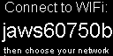  

Once *JAWS* has connected to your network it will display a Splash screen while it finishes initializing.

  

After initialization is complete, you will see the Time screen which displays the time in a large font, and the temperature and humidity below that.

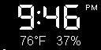  

If you press the button you'll move to the Temperature screen, then the Humidity Screen, the Barometric Pressure screen, and the "All Readings" screen

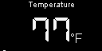  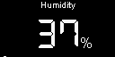  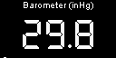  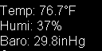  

The next button press takes you to the Graph screen. It shows a graph of the temperature over time as well as the high temp and low temp shown on the graph and the current temperature.

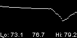  

Another button press takes you to the Info screen which shows various information such as the version of *JAWS*, the hostname, IP address, and WiFi signal strength.

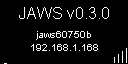

Press the button again and you will be taken to the "Off" screen. You'll see the word "Off..." display for 2 seconds and then the screen will go black. Pressing the button at any time will move back to the Time screen and the cycle begins again.

<a name="dev-info"></a>
## Operational Info for Developers

### Developer Endpoints and the Developer Menu

**Developer Menu**

There are a number of web endpoints for developers that can help with extending and debugging *JAWS*. Each of the endpoints is listed below. Though it is not normally part of the main menu, you can get to an additional page of options by entering the url `http://[JAWS_Address]/dev` into your browser. Once you go to that page, you'll get an option to enable the Developer menu item which will make it easier to get to in the future.

Internally this has the effect of changing the value of the `showDevMenu` setting. If you prefer to have the Developer menu on by default, you can edit `JAWSSettings.h` and initialize  `showDevMenu` to `true`.

**Viewing your settings**

It can sometimes be useful to see all the settings in their JSON representation. The `/dev` page has a `View Settings` button which will return a page with the JSON representation of the settings. You can also get to this page directly with the url `http://[MultiMon_Adress]/dev/settings`. If you save these settings as a file named `settings.json` and place it in your `data` directory, it can be uploaded to your device using `ESP8266 Sketch Data Uploader`. There is no need to do this, but developers may find it useful to easily switch between batches of settings.

The `/dev` page also has a `View WebThing Settings` button which will return a page with the JSON representation of the WebThing settings. This includes things such as the hostname, API keys, and the web color scheme.

**Screenshots**

Similarly you can get a screen shot of whatever is currently displayed on the device using the `Take a screen shot` button. This will display an image in your browser which corresponds to the current content of the display. You can also get to this page directly with the url `http://[MultiMon_Adress]/dev/screenShot`.

**Rebooting**
Finally, the `/dev` page also has a `Request Reboot` button. If you press the button you will be presented with a popup in your browser asking if you are sure. If you confirm, your *JAWS* device will immediately reboot as if the reset button had been pressed.

### Optional Integration with HomeBridge

Your weather station is able to report information into the Apple HomeKit world via [HomeBridge](https://github.com/nfarina/homebridge). In particular, if you install the [`homebridge-http-temperature-humidity` plugin](https://www.npmjs.com/package/homebridge-http-temperature-humidity), you can configure it to request readings from *JAWS*. To do so, follow the plugin's instructions on how to configure it in HomeBridge. This involves editing a JSON config file. This config file will contain a URL that points to the weather station. For example:

	"accessories": [
	       "accessories": [
	       {
	           "accessory": "HttpTemphum",
	           "name": "Living Room Weather",
	           "url": "http://JAWS.local/weather",
	           "sendimmediately": "",
	           "http_method": "GET"
	       }
	   ]

## Acknowledgments

This project is a variation of the [Solar Powered WiFi Weather Station](https://www.instructables.com/id/Solar-Powered-WiFi-Weather-Station-V20/) from [instructables](http://instructables.com). It also leverages work from [3KU_Delta](https://github.com/3KUdelta)'s [Solar WiFi Weather Station Project](https://github.com/3KUdelta/Solar_WiFi_Weather_Station) which in turn leverages other work. Additionally, the web interface uses the [WebThing](https://github.com/jpasqua/WebThing) library which borrows from / is inspired by [Qrome](https://github.com/Qrome)'s great [Octoprint Printer Monitor](https://github.com/Qrome/printer-monitor). 


