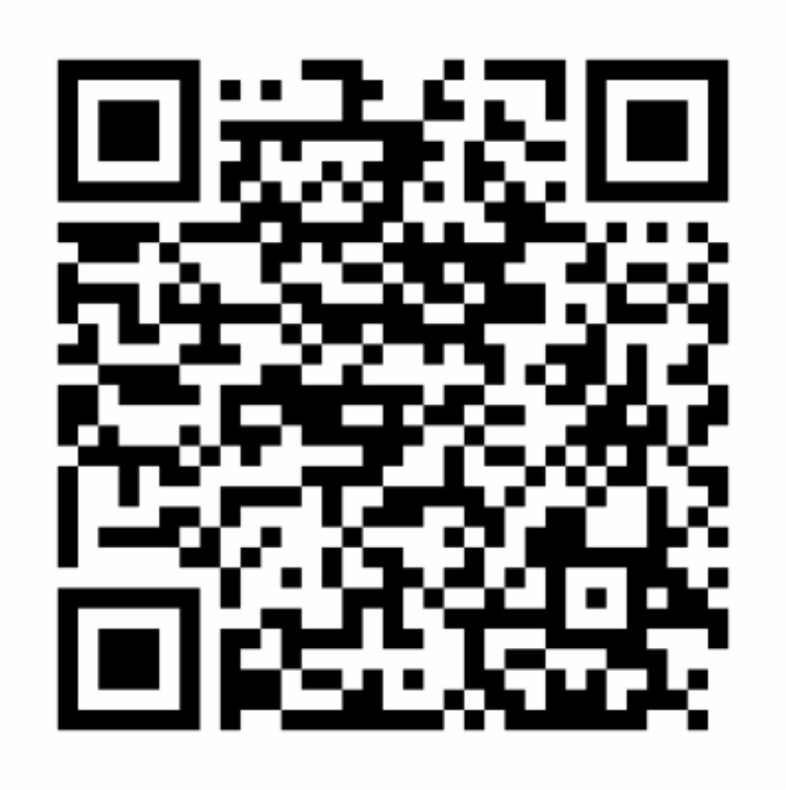

# JAWS - Just Another Weather Station

This is just another weather station (JAWS) which is derived from the [Solar Powered WiFi Weather Station](https://www.instructables.com/id/Solar-Powered-WiFi-Weather-Station-V20/) project from [instructables](http://instructables.com). You build some electronics, 3D-print a case, load this software, configure an app on your phone, and you're all set. What could be simpler? This software relies on the [Blynk](https://blynk.io) service to collect data in the cloud and make it available to the app on your phone. In the future, other services may be supported.

The weather station is configured using a Web User Interface where the user will specify information such as:

* The location of the weather station
* How often it should take readings
* API keys for the underlying services (like Blynk)
* etc.

Some of this configuration information is specific to JAWS while other information is common to any web-connected device. You can learn more about such `WebThing`'s [here](https://github.com/jpasqua/WebThing).

## Dependencies

### Libraries
The following third party libraries are used within this project:

* [Adafruit_BME280](https://github.com/adafruit/Adafruit_BME280_Library)
* [Adafruit_Sensor](https://github.com/adafruit/Adafruit_Sensor) 
* [Arduino-Log](https://github.com/thijse/Arduino-Log)
* [ArduinoJson (v6)](https://github.com/bblanchon/ArduinoJson)
* [BlynkSimpleEsp8266](https://github.com/blynkkk/blynk-library)
* [ESPTemplateProcessor](https://github.com/jpasqua/ESPTemplateProcessor)
* [TimeLib](https://github.com/PaulStoffregen/Time.git)
* [WebThing](https://github.com/jpasqua/WebThing)

### Services
The following services play a role in providing parts of the functionality:

 - [Blynk](https://blynk.io): Provides a repository of weather data and the ability to view using a mobile app. Without this you will only be able to see current values via the we interface.
 - Services used by WebThing
	 - [Google Maps](https://developers.google.com/maps/documentation): Used for geocoding and reverse geocoding. Though not absolutely necessary, it does make using the system a bot more convenient.
	 - [TimeZoneDB](https://timezonedb.com): Used to get local time and time zone data. This is used to timestamp data.

### Hardware
The complete list of required hardware and assembly instructions can be found on the [instructables site](https://www.instructables.com/id/Solar-Powered-WiFi-Weather-Station-V20/). There is one variation in the assembly instructions. On the PCB for the project (available on [PCBWay](https://www.pcbway.com/project/gifts_detail/Solar_Powered_WiFi_Weather_Station_V2_0.html)), The D7 pin is exposed on a female header along with VCC and GND. In this project D7 is used as to override the setting for low power mode. You can build the board as shown and then use a jumper from D7 to GND in order to activate the override. What I did instead was to place another of the small slide switches in that spot. I used only two of the three legs so that I could easily connect D7 to GND. The software uses a pullup on D7 so it is normally high (meaning no override of the setting for low power mode).

### 3D Model
The original housing for this project as well as some others are available on thingiverse. Here is a sampling:

 - [Original](https://www.thingiverse.com/thing:3395393)
 - [Alternative 1](https://www.thingiverse.com/thing:3615016)
 - [Alternative 2](https://www.thingiverse.com/thing:3551386)

## First Use

Once you have assembled your hardware and loaded the firmware, the weather station will boot and create its own WiFi access point. Connect to the new access point you will see on your phone or computer's wifi connection list. It will have an SSID of the form `jaws-nnnnnn`. Once you do, you will enter a "captive portal" where you can configure the weather station for your actual WiFi base station. When you've done that, you can reset the weather station and it will connect to your wifi network.

At this point it will make a web interface available. You can connect using either an IP address or a hostname:

- **IP Access**: You need to determine the IP Address used by the weather station. You have a couple of choices here:
    - If you are still connected via USB, you will see the IP address in the Arduino Serial Monitor
    - You can use a scanning tool or your router to look for the device on your network
- **Hostname**: If your system supports mDNS (e.g. a Mac or a Raspberry Pi running avahi) you can connect to hostname.local in your browser. Hostname will either by a name that you set in Settings.h or a name of the form `jaws-nnnnnn`.

## Settings

Once connected, you can use the web interface to view readings or change settings. There are a number of base settings that are common to all [WebThing](https://github.com/jpasqua/WebThing)'s.
The available settings are:

- Description: A description that is useful to the user. For example, the location of the weather station
- Blynk API Key: An API key established by the user when configuring the Blynk app.
- useMetric: Determine whether to use metric or imperial units when sending values to Blynk or displaying values in the web interface
- tempCorrection: A value (positive or negative) to add to the temperature sensor reading to calibrate it to a reading you've taken with a known correct device. Note that this is always in degrees celsius even if the values are to be displayed in imperial units.
- humiCorrection A value (positive or negative) to add to the humidity sensor reading to calibrate it to a reading you've taken with a known correct device. 

## Operation

**JAWS** lets you view your weather data using the Blynk App for [iPhone](https://itunes.apple.com/us/app/blynk-control-arduino-raspberry/id808760481?ls=1&mt=8) or [Android](https://play.google.com/store/apps/details?id=cc.blynk). Follow these steps to get going:

1. Download the appropriate app using the links above.
2. Open the Blynk app and create a new Blynk account if you don't have one already.
3. Touch the QR code icon at the top of the screen.
4. Scan the QR code below. This will load the Solar Weather Station app which you may customize if you wish using the Blynk app (no coding required).
5. Blynk will send you an "Auth Token" via email. Enter this in the settings screen of the web interface in the field labeled "Blynk API Key". Hit save and restart the weather station.
6. Use the Blynk app to see current and historical values.

Blynk QR Code: </img> 

### Integration with HomeBridge

Your weather station is able to report information into the Apple HomeKit world via [HomeBridge](https://github.com/nfarina/homebridge). In particular, if you install the [`homebridge-http-temperature-humidity` plugin](https://www.npmjs.com/package/homebridge-http-temperature-humidity), you can configure it to request readings from JAWS. To do so, follow the plugin's instructions on how to configure it in HomeBridge. This involves editing a JSON config file. This config file will contain a URL that points to the weather station. For example:

	"accessories": [
	       "accessories": [
	       {
	           "accessory": "HttpTemphum",
	           "name": "Living Room Weather",
	           "url": "http://JAWS.local/weather",
	           "sendimmediately": "",
	           "http_method": "GET"
	       }
	   ]

## Acknowledgments

This project is a variation of the [Solar Powered WiFi Weather Station](https://www.instructables.com/id/Solar-Powered-WiFi-Weather-Station-V20/) from [instructables](http://instructables.com). It also leverages work from [3KU_Delta](https://github.com/3KUdelta)'s [Solar WiFi Weather Station Project](https://github.com/3KUdelta/Solar_WiFi_Weather_Station) which in turn leverages other work. Additionally, the web interface uses the [WebThing](https://github.com/jpasqua/WebThing) library which borrows from / is inspired by [Qrome](https://github.com/Qrome)'s great [Octoprint Printer Monitor](https://github.com/Qrome/printer-monitor). 

